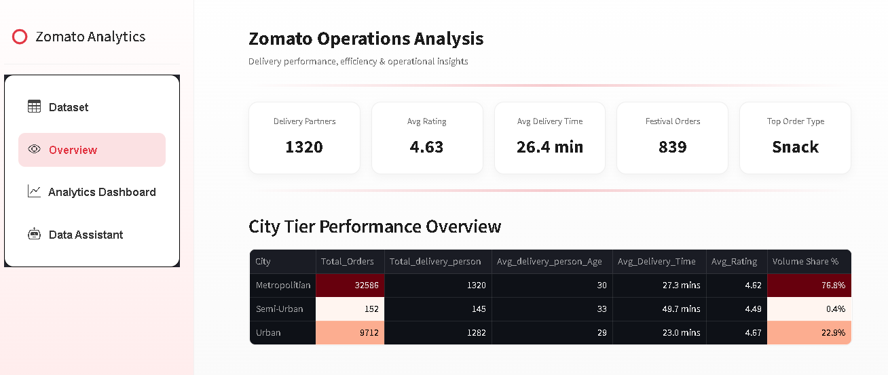
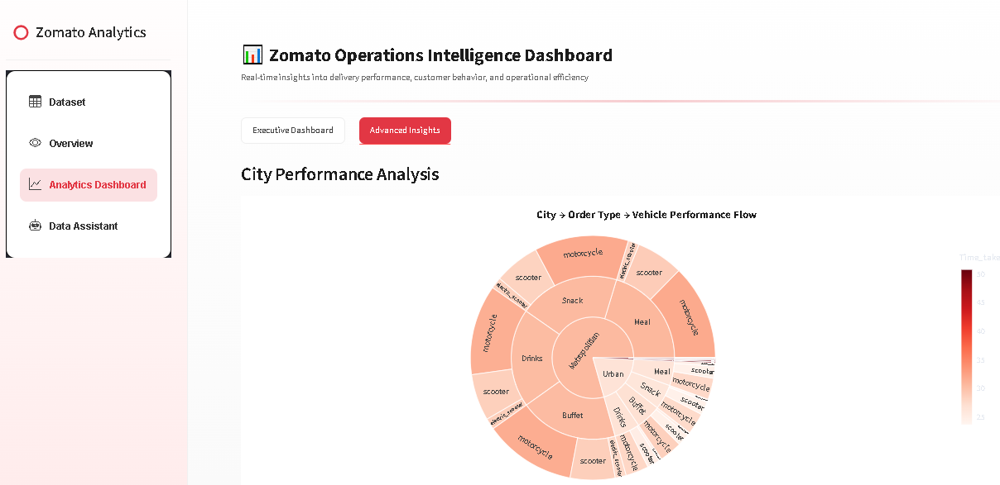
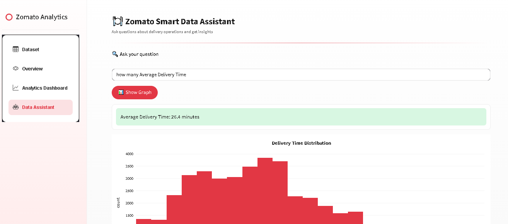

# 🍽️ Zomato Analytics Dashboard  
### 🚀 Next-Generation Food Delivery Intelligence Platform with Smart Insights

<p align="center">
  
  
  
  
  
  
</p>

<p align="center">
  <b>Transform raw delivery data into powerful operational insights with an interactive analytics platform.</b>
</p>

---

## 📌 Overview

The **Zomato Analytics Dashboard** is a **high-end, interactive data analytics platform** designed to explore, analyze, and visualize food delivery operations data in a visually rich and intuitive way.

This project combines:

- 📊 Advanced Delivery Data Analytics  
- 📈 Interactive Dashboards  
- 🤖 Smart Data Assistant  
- 🎨 Modern Zomato-inspired UI/UX  

It simulates a **real-world logistics & delivery intelligence system**, making it ideal for:

- 🚀 Portfolio Projects  
- 💼 Data Analyst / BI Developer Roles  
- 📊 Business Intelligence Showcases  

---

## 🌟 Why This Project Stands Out

✔ Complete analytics ecosystem (not just charts)  
✔ Smart query-based data assistant  
✔ Premium Zomato-style UI design  
✔ End-to-end workflow (Explore → Analyze → Visualize → Interact)  
✔ Real-world delivery analytics use case  

---

## ✨ Features

### 📂 Interactive Dataset Explorer
- Column selection & filtering  
- Smart search across dataset  
- Dynamic row control  
- Download filtered dataset (CSV)  
- Dataset statistics & insights  

---

### 📊 KPI Insight Cards
- Total Orders  
- Average Delivery Time  
- Delivery Ratings  
- Festival Orders  
- Delivery Partners Count  

---

### 📈 Analytics Dashboard

#### 🔹 Executive Dashboard
- Order demand trends (hourly analysis)  
- City distribution  
- Traffic impact on delivery  
- Weather-based performance  

#### 🔹 Advanced Insights
- Sunburst (City → Order → Vehicle)  
- Treemap analysis  
- Heatmaps (Traffic vs Weather)  
- Sankey flow analysis  
- Box plots (Delivery time distribution)  

✔ Fully interactive charts (zoom, hover, filter)

---

### 🤖 Smart Data Assistant

Ask questions like:

- “Total orders”  
- “Best city for delivery”  
- “Traffic impact”  
- “Average delivery time”  

✔ Instant answers  
✔ Graph visualization support  
✔ Business-level insights  

---

### 🚗 Operational Insights

- Vehicle performance analysis  
- Order type distribution  
- Peak hour detection  
- Top delivery partner tracking  
- Festival impact analysis  

---

### 🎨 Premium UI/UX

- Zomato-inspired design 🔴  
- Clean card-based layout  
- Smooth hover animations  
- Responsive dashboard  
- Custom sidebar navigation  

---

### 🧹 Data Quality System

- Missing values handling  
- Duplicate removal  
- Data cleaning pipeline  
- Real-world dataset preparation  

---

### 🧭 Multi-Page Navigation

- Dataset Explorer  
- Overview Dashboard  
- Analytics Dashboard  
- Smart Data Assistant  

---

## 🛠️ Tech Stack

| Category        | Technology |
|----------------|-----------|
| Language       | Python |
| Framework      | Streamlit |
| Data Analysis  | Pandas |
| Visualization  | Plotly |
| UI Styling     | Custom CSS |
| Data Handling  | CSV Processing |

---

## 📊 Dashboard Preview

> 📌 Add screenshots in `/images` folder

### 🍽️ Main Dashboard


### 📈 Analytics Dashboard


### 🤖 Data Assistant


---

## ⚙️ Installation & Setup

### 1️⃣ Clone Repository
```bash
git clone https://github.com/your-username/zomato-analytics-dashboard.git
cd zomato-analytics-dashboard